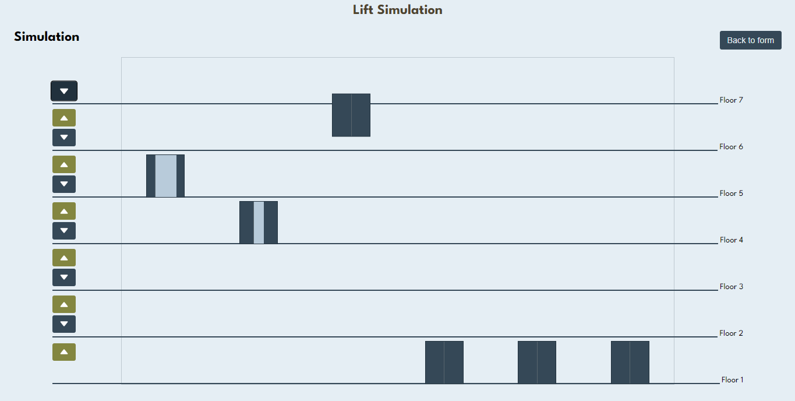

# Lift-Simulation

Lift Simulation created with Vanilla JS, HTML, CSS.

## Screenshot



## Live

[Live Demo](https://lift-simulation-ajoy.vercel.app/)

## Run Locally

To run the simulator locally,

1. Clone the repository

   ```markdown
   git clone https://github.com/ajoykumardas12/lift-simulation.git
   ```

2. Open lift-simulation folder.

3. Open index.html in your browser.
